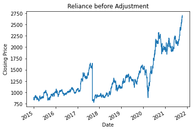

Check out Installation first.
<details open markdown="block">
  <summary>
    Table of contents
  </summary>
  {: .text-delta }
1. TOC
{:toc}
</details>

## **Downloading Data**
{:toc}

You can specify the date range either using start and end date or using the full_data. 

### **Using start and end date** 
Here the date is specified in 'dd-mm-yyyy' format

```python
from NSEDownload import stocks
AsianP = stocks.get_data(stockSymbol = 'ASIANPAINT', start_date = '1-1-2015', end_date = '1-1-2022')
```
Output Dataframe (AsianP) :
```
                Symbol Series  ...  % Dly Qt to Traded Qty   
Date                           ...                           
2015-01-01  ASIANPAINT     EQ  ...                   37.18   
2015-01-02  ASIANPAINT     EQ  ...                   41.90   
2015-01-05  ASIANPAINT     EQ  ...                   56.06   
2015-01-06  ASIANPAINT     EQ  ...                   39.90   
2015-01-07  ASIANPAINT     EQ  ...                   44.10   
...                ...    ...  ...                     ... ..
2021-10-08  ASIANPAINT     EQ  ...                   48.57   
2021-10-11  ASIANPAINT     EQ  ...                   42.03   
2021-10-12  ASIANPAINT     EQ  ...                   51.17   
2021-10-13  ASIANPAINT     EQ  ...                   49.39   
2021-10-14  ASIANPAINT     EQ  ...                   47.15  

[1681 rows x 15 columns]
```
### **Using Full Data**
Full data gives data from the inception of stock to today.
```python
from NSEDownload import stocks
AsianP_full= stocks.get_data(stockSymbol = 'ASIANPAINT', full_data=True)
```

Output Dataframe (AsianP_full):
```
                Symbol Series  ...  % Dly Qt to Traded Qty   
Date                           ...                           
1996-01-01  ASIANPAINT     EQ  ...                       -   
1996-01-02  ASIANPAINT     EQ  ...                       -   
1996-01-03  ASIANPAINT     EQ  ...                       -   
1996-01-04  ASIANPAINT     EQ  ...                       -   
1996-01-05  ASIANPAINT     EQ  ...                       -   
...                ...    ...  ...                     ... ..
2021-10-08  ASIANPAINT     EQ  ...                   48.57   
2021-10-11  ASIANPAINT     EQ  ...                   42.03   
2021-10-12  ASIANPAINT     EQ  ...                   51.17   
2021-10-13  ASIANPAINT     EQ  ...                   49.39   
2021-10-14  ASIANPAINT     EQ  ...                   47.15   

[6422 rows x 15 columns]
```


## **Getting Adjusted Data**
{:toc}
This takes care of splits and bonus events after 2010. All events before that are not adjusted.

```python
from NSEDownload import stocks
df = stocks.get_data(stockSymbol = 'RELIANCE', start_date = '1-1-2015', end_date = '1-1-2022')
df = stocks.get_adjusted_data('RELIANCE', df)
```
Ouput :
```
RELIANCE
BONUS  on :  07-Sep-2017  and ratio is :  2.0
```
Adjusts can be easily check by plotting the closing price :

|   Before Adjustment 	|   After Adjustment 	| 
| :--------:	        |   :--------:	        |
|            |    |

There is a straight line parallel to y-axis towarsd the end of 2017 in the first image showing a bonus or split event. The second image is adjusted for the event.